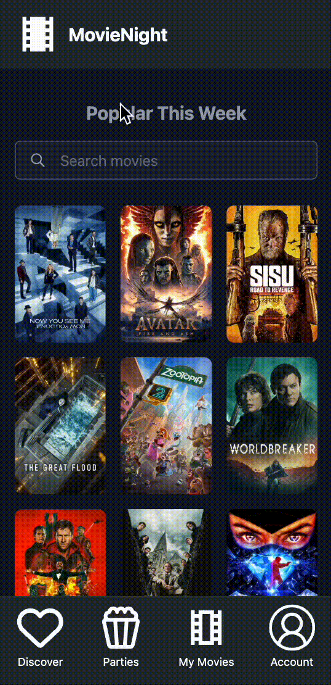
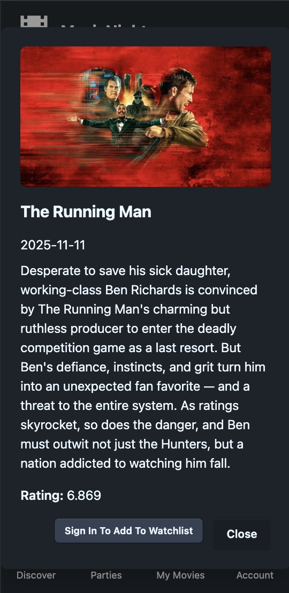
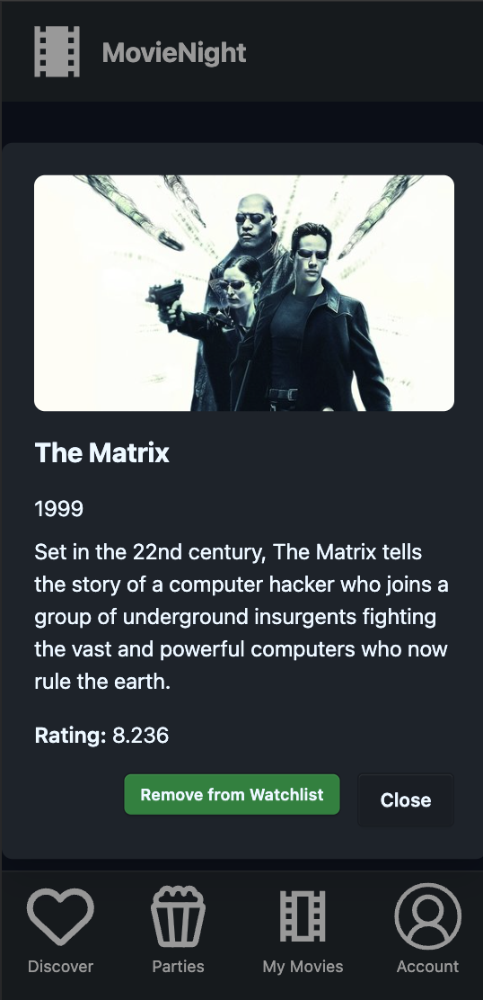
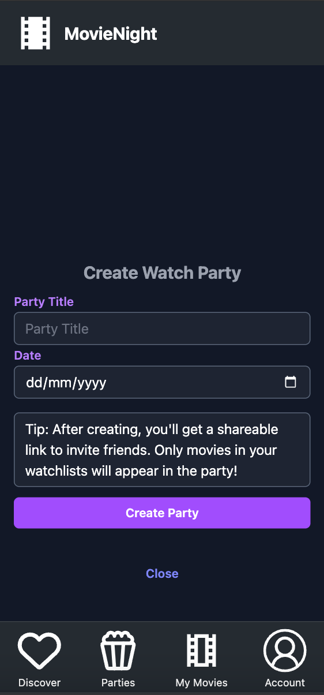
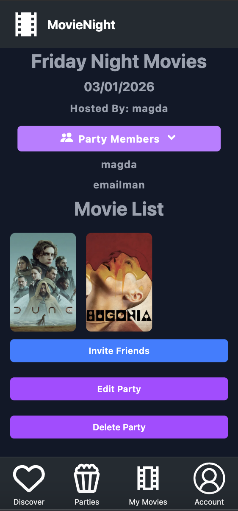
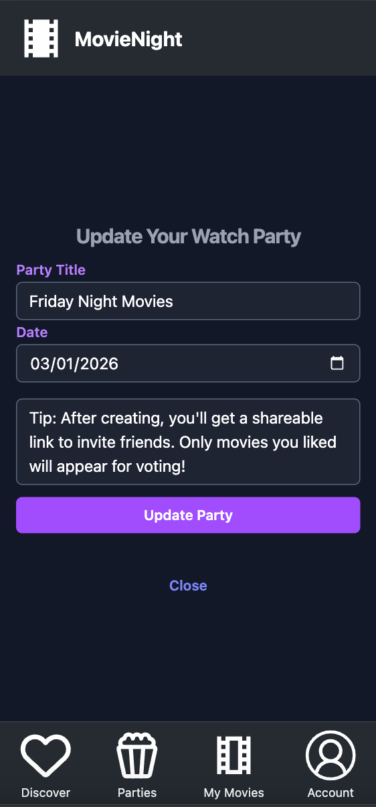
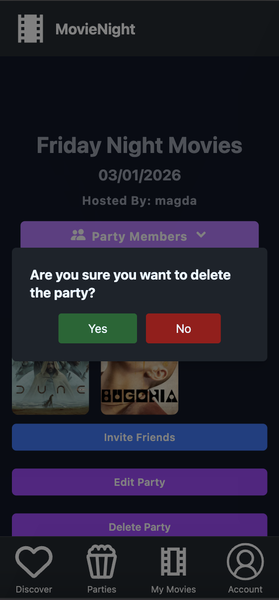
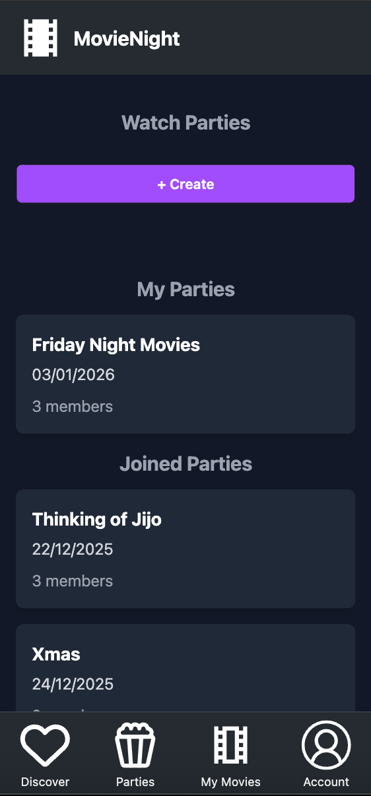

# MovieNight App

# Description

The Problem:
Have you ever spent ages scrolling through your streaming platform of choice, only to find nothing to watch? Or planned a fun movie night with friends, only to struggle to agree on what to put on?

The Solution:
MovieNight helps users discover movies by browsing a large catalog and adding titles to their personal watchlists. Users can then create watch parties and invite friends to join. When a friend joins a party, one movie from their watchlist is randomly added to the party’s selection. On the day of the event, the group chooses from a curated list of movies—making decision-making easy and fun.

This is my fourth and final project from my three-month intensive bootcamp at General Assembly.

*This app has two repositories: frontend and backend

Code snippets in this ReadMe are from frontend, for backend, please go here - [Backend ReadMe](https://github.com/MCegla-JW/movie-night-backend)

# Deployment Link 

🍿The App: [MovieNight](https://movienight-app-project.netlify.app/movies)

# Timeframe & Working Team 

## Timeframe: 9 days (solo project)

| Time | Task 
|:-----| :-----
| Day 1 | Planning (user stories, ERD, Miro wireframe)
| Day 2 | Backend Setup + Models + Admin 
| Day 3 | Authentication + TMDB Integration 
| Day 4 | Watchlist System Creation 
| Day 5 | Voting System + Winner Logic
| Day 6 | Party Creation + Join System
| Day 7 | Frontend Setup + Authentication UI
| Day 8 | Discover + Watchlist UI
| Day 8 | Party UI + Voting Interface
| Day 9 | Polish + Testing + Bug Fixes + Deployment + Presentation

# Technologies Used

## Frontend:

- React
- JavaScript (ES6)
- JSX
- React Router
- Tailwind CSS
- DaisyUI
- Headless UI
- HTML5
- npm
- localStorage

## Backend/ APIs: 

- Python
- Django
- Django REST Framework
- Pipenv
- PostgreSQL (Neon)
- Django Authentication
- JSON Web Tokens (JWT)
- TMDB API
- axios

## Development & Design Tools:

- Miro
- Trello 
- Postman (API testing)
- VSCode

## Deployment: 

- Heroku (server)
- Netlify (client)

## Version Control:

- Git 
- GitHub

## Features 

- User Authentication: Secure sign-up, sign-in and sign-out functionality using a JSON Web Token (JWT)
- TMDB API Integration: Access to The Movie Database for movie discovery and metadata
- CRUD Operations: Create, read, update and delete parties
- Party Join Codes: Unique join codes allow users to join specific parties
- Random Movie Selection: Movies are randomly added to parties from user watchlists
- Responsive Design: Mobile-first, fully responsive UI
- Error Handling & Validation: Server-side and client-side validation to prevent invalid data submission
- Environment Variable Security: Sensitive keys managed through .env files

## Brief

The project requirements included:

- The back-end is built with Django and Python
- The front-end is built with React
- PostgreSQL (Neon) is used as the database management system
- Both the back-end and front-end implement JWT token-based authentication for user sign-up, sign-in, and sign-out
- Authorization is enforced across the application: guest users (not signed in) cannot create, update, or delete data, or access functionality for those actions. They can only view the
- Discover page and cannot add movies to their watchlist until signed in
- The project includes at least two data entities in addition to the User model, with multiple relationships between them
- There is full CRUD functionality on at least one model, implemented on both the front-end and back-end
- The front-end does not store any secret keys. Any public APIs requiring secret keys are accessed via the back-end
- The project is deployed online and accessible to users worldwide

# Planning

Theme: I am a big movie fan and I wanted to make something that I could use myself - I don't use Letterboxd but I wanted to make something similar to manage my watchlist 

Entity Relationship Diagram (ERD): Created an ERD to visualize the relationships between Users, Watchlist, Parties and Movies

Wireframes: Developed wireframes in Miro to establish the basic layout and user flow through the application

Project Document: Created a comprehensive document detailing the user journey alongside the wireframes to help visualize the flow and functionalities

Project Management: Used Trello to organize tasks, track progress, and manage the project timeline effectively

# Build/Code Process

## Watchlist Rendering Challenge 

On the Discover page, movie data comes directly from the TMDB API, but the Watchlist pulls movies from Neon (PostgreSQL). Initially, movies in the Watchlist were not displaying correctly — images appeared as empty strips, and clicking them did not show details

After debugging, I realized the issue was with the database models. I updated the MovieModal and MovieCard components to conditionally fetch and render movie data depending on whether it came from TMDB or the database, ensuring consistent display across the app

```js
const MovieModal = ({ movie, onClose, isOnWatchlist, addToWatchlist }) => {
  if (!movie) return null;

  const m = movie.movie || movie; // handle DB vs API
  const backdropUrl = m.backdrop_path || m.backdrop;
  const rating = m.vote_average || m.rating;

  return (
    <div className="modal modal-open">
      <div className="modal-box">
        
        <h3>{m.title}</h3>
        <p>{m.overview || 'No overview available'}</p>
        <p>Rating: {rating}</p>
        <button onClick={onClose}>Close</button>
      </div>
    </div>
  );
};

```

## Invite Friends Modal

I used Headless UI to create a modal where users can store and retrieve their party join code. The modal includes a “Copy to Clipboard” button for easy sharing, making it simple to invite friends to watch parties

```js
const MyModal = ({ party }) => {
  const joinLink = `${window.location.origin}/parties/join/${party?.join_code}`;

  const copyToClipboard = () => {
    navigator.clipboard.writeText(joinLink)
      .then(() => alert("Link copied to clipboard"))
      .catch((err) => console.error("Failed to copy:", err));
  };

  return (
    <button
      onClick={copyToClipboard}
      className="mt-2 w-full rounded-md bg-purple-500 px-3 py-1.5 text-white hover:bg-purple-600"
    >
      Copy Link
    </button>
  );
};
```
| Join Code Modal Demo | 
|---------------------|
|| 

## Reusable Components 

I created reusable components such as MovieCard, MovieModal, NavBar, BottomNavBar, PartyCard, PartyDetails keep the UI modular and maintainable. Components are structured for clarity and separation of concerns

| Reusable Movie Components Demo | 
|---------------------|
| | 

*Demonstration of reusable MovieCard and MovieModal components across multiple pages (Discover, Watchlist, Party) and consistent rendering of Navbar and BottomNavBar on each page*

## Planning & Wireframes: 

I designed the user interface and flow using wireframes in Miro, ensuring a clear, intuitive layout before coding

📓[Miro Board](https://miro.com/welcomeonboard/SWhsK2M4SDhKRlZxcWxkNXMwN2FhUVBMdm9HVGVNaTNGZnYrNUs3d2poQkgyZm1vNnVieXM4cVFlaFV3WGx6eFpndVA3MWZMZ2paTm42bk5WcG9pRFBJVkNPUTRUcFhaUkx6dUdXeWFRTTR5allMUUZqbmJjM29kd01UZy8vRUNQdGo1ZEV3bUdPQWRZUHQzSGl6V2NBPT0hdjE=?share_link_id=346039286400)

I also created a planning document containing the user flow, wireframes, data models, routing tables and links to supporting materials.
  
📑[Planning Word Doc](https://docs.google.com/document/d/1JNhUyX-8qCxzBIFX848Q8rcOJbRCzBLj7rZ0Pe1xPSM/edit?tab=t.0)

## Routing & Navigation: 

I implemented React Router for client-side routing, including protected routes for authenticated users and conditional rendering for guest users. Signed Out users can only see the Discover page, can search but can't add movies to watchlist

```js

{user ? (
          <button onClick={() => addToWatchlist(m)}>
            {isOnWatchlist ? 'Remove from Watchlist' : 'Add to Watchlist'}
          </button>
        ) : (
          <button onClick={() => navigate('/auth/sign-in')}>
            Sign In To Add To Watchlist
          </button>
        )}
```
| Signed Out User View | Signed In User View |
|---------------------|-------------------|
|  |  |

## Party CRUD Functionality

Users can create, view, update, and delete parties directly from the frontend

- Create Party: Users enter a party name and date; a unique join code is generated
- Read/Display Party: Parties are displayed in a card format, showing party name, date, and members
- Update Party: Party creators can edit party details such as the name or date (unique join code remains the same)
- Delete Party: Party creators can remove a party, which also removes associated movies from the selection
- Join Party: Users can join via a unique join code, which adds one random movie from their watchlist to the party

| Create Party | Read/Display Party | Update Party | Delete Party | Show All Parties |
|---------------------|-------------------|-------------------|-------------------|-------------------|
|  |  |  |  | 

## Challenges 

- Watchlist Challenge: Initially, movies in the Watchlist did not display correctly. Although the same MovieModal was used for both Discover and Watchlist pages, data from Neon (PostgreSQL) wasn’t rendering properly. I had to update the MovieModal and MovieCard components to conditionally fetch and render movie data depending on whether it came from TMDB API or the database
- Handling Multiple Data Sources: Learned to reference movie data differently depending on whether it was coming from the database or TMDB, ensuring consistent display across the app

## Wins

- TMDB Integration: I’m very pleased I successfully integrated TMDB into this project, including the search feature, to fetch and display movie data dynamically 
- Making an app that I will use in my personal life 
- Solidified my knowledge of React and mobile-first design; this project inspired me to explore React Native for future projects
- Using a new library for styling: I learned to use Tailwind CSS, DaisyUI, and Material UI. As I learned Material UI for my third project, the learning curve for Tailwind CSS was not as steep and took less time than I anticipated
- Error Handling & Validation: I implemented client-side checks and graceful handling of missing or inconsistent data
- Interactive Features & UX: I added modals, watchlist management, party creation and management and copy-to-clipboard functionality for a smooth user experience

## Key Learnings/Takeaways

- React: I solidified my knowledge of React and component-based development
- TMDB API and PostgreSQL: I gained experience fetching and conditionally rendering data from external APIs (TMDB) and working with a relational database (Neon/PostgreSQL)
- Tailwind CSS: I used a new styling library - Tailwind CSS, it made it easy to keep the styling consistent across the app 
- Modals: I deepened my understanding of modals and implemented them using DaisyUI and Headless UI
- Planning and Prototyping: I realized that thorough wireframing and prototyping during the planning stage makes frontend development faster and more efficient
- React Hooks: I learned how to manage component state effectively using React hooks (useState, useEffect, useContext) and localStorage
- Debugging and Troubleshooting: I learned to troubleshoot data rendering issues when working with multiple data sources

## Known Bugs

- When a movie is deleted from watchlist but is in a party, it remains in party 

## Future Improvements 

- Dark/Light mode
- BottomNavBar - icons are highlighted differently to indicate an active tab
- Party members can vote for movies in party and land on one winning one that they can watch on the day
- Solo watcher mode - feature in watchlist where a user can get a movie selected for them at random if they don't know what to watch 
- Users can leave party
- Party creator is notified that a new user joined the party
- Users can manually add a movie to party 
- Users can remove the random movie if they don't like it and another random movie is added 
- Connect to third party API to source weather data in each trip destination and display it for users 
- Users can rate movies

## Installation & Setup

| Step | Action |
|:-----| :----- |
| 1. Clone the repo | git clone https://github.com/MCegla-JW/movie-night-frontend.git & cd movie-night-frontend |
| 2. Install dependencies | npm install |
| 3. Create .env file with the following variables:| VITE_API_URL=https://movie-night-5d451cab1c10.herokuapp.com |
| 4. Start the development server | npm run dev |

